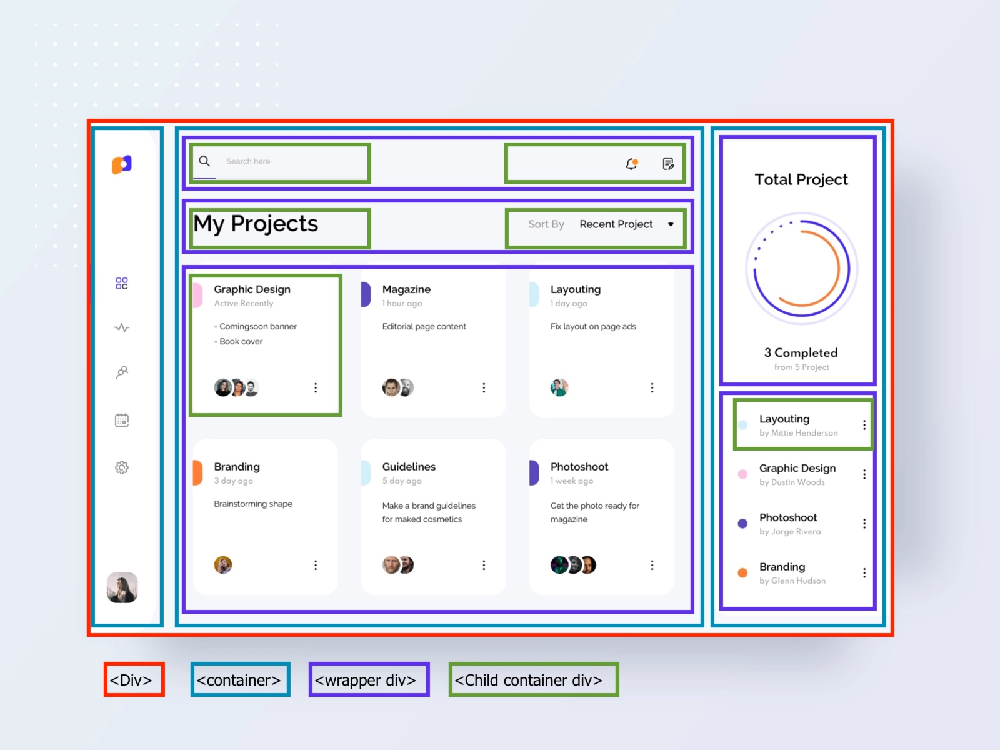

# Project Management Dashboard 

A data dashboard is an information management tool that visually tracks, analyses and displays key performance indicators (KPI), metrics and key data points to monitor the health of a business, department or specific process. They are customisable to meet the particular needs of a department and company. Behind the scenes, a dashboard connects to your files, attachments, services and API’s, but on the surface displays all this data in the form of tables, line charts, bar charts and gauges. A data dashboard is the most efficient way to track multiple data sources because it provides a central location for businesses to monitor and analyse performance. Real-time monitoring reduces the hours of exploring and a long line of communication that previously challenged companies.

This lesson shows how to create a reusable and customisable dashboard with HTML, CSS, JavaScript, and ChartJs.

## Helpful Links
- [Google Icons](https://fonts.google.com/icons)
- [Material Icons Guide](https://developers.google.com/fonts/docs/material_icons)
- [HTML <option> value Attribute](https://www.w3schools.com/tags/att_option_value.asp)
- [Chart.js](https://www.chartjs.org/docs/latest/)
- [chart.js CDN](https://www.jsdelivr.com/package/npm/chart.js)
- [Font - Nunito](https://fonts.google.com/specimen/Nunito?query=nuni)
- [Develop responsive web apps](https://responsively.app)

